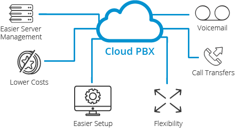
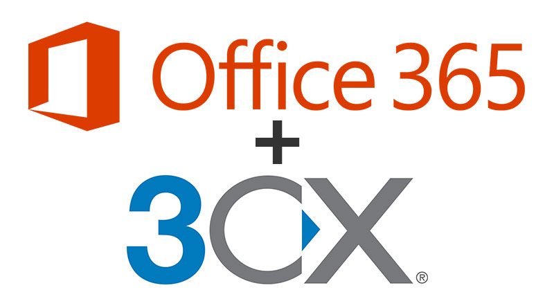

# Centralita

En RuheIT hemos desplegado una centralita que nos permite hacer y recibir llamadas de manera interna y externa.

A esta centralita podemos conectarnos: 

* Vía Softphone: un software en nuestro móvil o pc que nos permite conectarnos con el servidor.
* Vía un teléfono IP: nuestra centralita permite la conexión de la mayoría de teléfonos IP.

Esta centralita ha sido desplegada en AWS y utiliza el software 3CX para funcionar.

## ¿Qué es 3CX?

3CX es un PBX (private branch exchange) que funciona mediante el protocolo SIP. Es un PBX que puede ser hosteado en la nube o de manera local y permite configurarse vía una interfaz web (nada de comandos, aunque está disponible una shell).

## ¿Cómo funciona una centralita IP?

Una centralita consiste en:

* Un PBX (o servidor SIP), en este caso 3CX.
* Uno o más teléfonos IP compatibles con el protocolo SIP.
* Un SIP Trunk: permite conectar un teléfono de la PSTN (Public Service Telephony Network) a nuestra centralita, en nuestro caso utilizamos un SIP Trunk de la empresa Netelip para poder recibir llamadas.

***

Dentro de nuestra centralita IP tenemos configurado lo siguiente:

* Usuarios
* Ring Groups
* Paging
* SIP Trunk
* Reglas de entrada y salida
* Virtual Recepcionists (IVR)

## Gestión de usuarios

Siguiendo la línea de la empresa, los usuarios están sincronizados con Azure AD. Todos los usuarios que creamos en nuestro entorno de Active Directory local y sincronizamos con Azure AD disponen de un usuario en nuestra centralita.

Gracias a esto se ha implementado el SSO para acceder tanto a los softphones cómo al panel de administración, lo que permite una vez más no disponer de una contraseña más para un servicio, y delegar así la autenticación en nuestro IdP de preferencia.

Cada usuario dispone de una extensión asignada, así como de un teléfono (softphone, físico o los 2).

## Ring Groups

Un ring group es una ruta de llamadas que tiene una extensión propia, cuando un usuario o IVR llama a esa extensión puede efectuar 2 cosas:

* Prioritised Hunt: llama a la primera extensión del grupo, después a la otra...
* Ring all: llama a todos hasta que responda la llamada un miembro del grupo.

En nuestro caso, cada departamento tiene su ring group, lo que facilita la comunicación entre departamentos. Estos ring groups pueden ser llamados de manera interna 

!!! note "Mejoras"

    Algo a considerar para futuro, es que cada ring group o departamento disponga de su CID (Caller ID, un número externo).

## Paging

El paging es usado para enviar mensajes de voz a X extensiones, es comúnmente usados para hacer anuncios relevantes.

El paging funciona sin que el usuario tenga que responder la llamada, por lo que es útil para "broadcastear" mensajes.   
## SIP Trunk

### ¿Qué es un SIP Trunk?

Un SIP trunk es la versión digital de una línea analógica de teléfono, usando SIP trunks podemos conectarnos a cualquier número de teléfono que nos proporcione nuestro proveedor de manera digital, pudiendo tener un teléfono en cualquier parte del mundo vía internet.

### ¿Qué es un proveedor de SIP Trunk?

Un proveedor de SIP Trunk es la empresa que nos proporciona el número de teléfono virtual, por ejemplo:

* Telefónica
* Amazon Chime
* OVH
* DidLogic
* Netelip
* Digium
* Twillio

Tras probar varios, decidimos quedarnos con Netelip para el proyecto ya que nos proporciona un número de manera gratuita que nos permite recibir llamadas al número +34 810101756.

!!! info "¿Qué es este número y que tiene de especial?"

    Si nos fijamos, este no es un número fijo convencional que empieza por 9, es un número que empieza por 810. Estos números son llamados "nómadas VOIP", no han de ser confundidos con números de tarificación especial. Permiten a la empresa tener asignado un número de teléfono con independencia de su localización geográfica y se realiza vía IP. El coste de las llamadas a estos números es el mismo que el de llamar a un fijo. 
