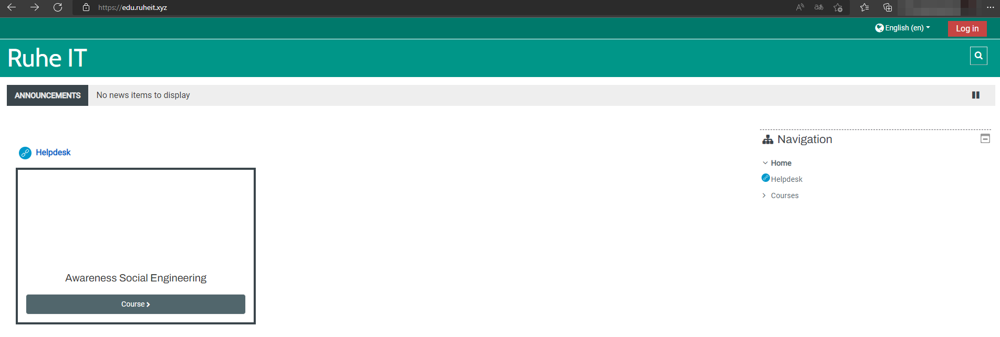
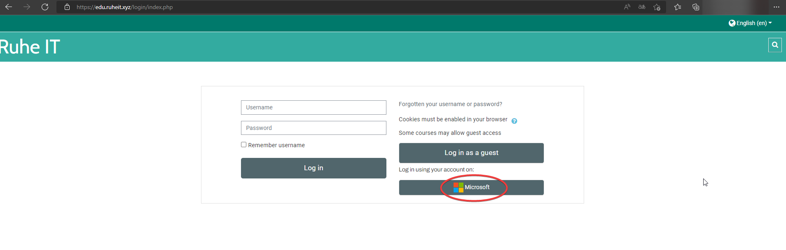
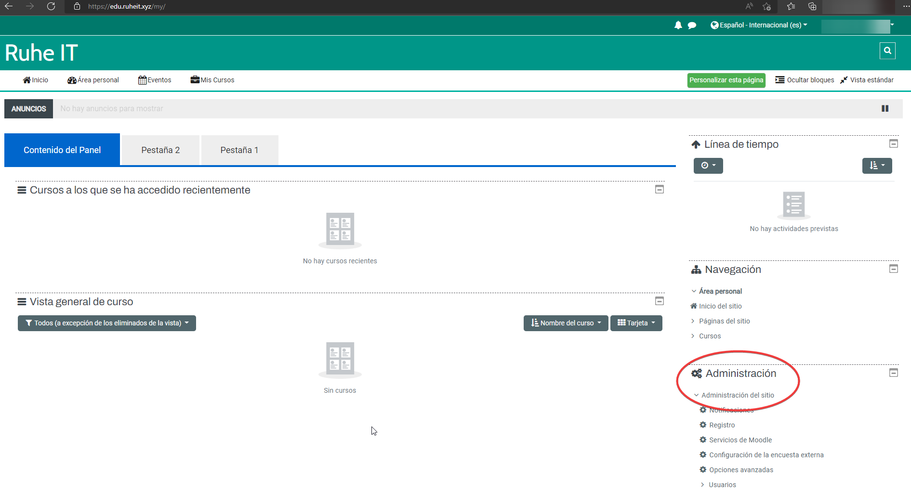

# Moodle

Moodle, és un CMS (Content Management System) , esta aplicación va más dirigida hacia estudiantes o realizar formaciones más especificas. En el caso de RuheIT, lo utilizamos para poder realizar formaciones a nuestros trabajadores y realizar formaciones Awarness, dirigido hacia las empresas.

## En que facilita Moodle a Ruhe?

Por lo que hemos explicado, moodle nos facilita a la hora de generar clases o cursos más específicos que queramos realizar. Aqui podemos ver una visión general de moodle que tiene RuheIT. Ya que moodle como hemos mencionado, es un CMS el cual nos permite generar y crear la web de una forma más sencilla.

## Como funciona el login interno de los empleados de Ruhe?

En esta imagen, podemos ver que en el panel de inicio de sesión, los empleados internos accedemos mediante SSO (Single Sign On), el cual tiene una conexión con nuestras cuentas de Microsoft y poder utilizar nuestras cuentas internas en Moodle.

## Como se gestiona moodle en RuheII?

Utilizamos la herramienta de administración la cual, nos permite poder crear y modificar todos los parámetros de moodle, asi como:

- Creación de usuarios
- Archivos
- Formaciones de cursos
- Gstión de plugins.

