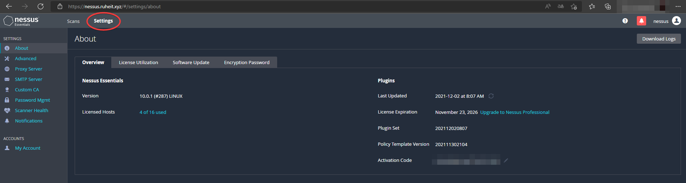
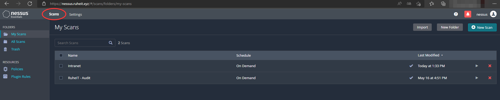

# Nessus

Nessus es una herramienta de escaneo remota, la cual en el caso de RuheIT ha sido desplegada en docker, esta herramienta escanea y alerta si descubre alguna vulnerabilidad que pueda ser explotada de manera local y remota. Normalmente estas vulnerabilidades se catalogan según el tipo de critícidad de la vulnerabiliad, entre ellas pueden ser:

- **Críticas**
- **Altas**
- **Medias**
- **Bajas**
- **Informativas**

## ¿Para que sirve realmente Nessus?

Esta herramienta és utilizada para poder realizar un "barrido inicial", sobre la web en cuestión para poder ver de una forma general que se podría encontrar. Normalmente suele ser usada para auditorías o cómo escáner persistente de la red interna/externa.

Nessus es usado por todo tipo de empresas, normalmente las que tengan un gran presupuesto, ya que su precio no es muy asequible para todo el mundo.

## ¿Por qué Nessus?

Nessus nos ofrece una generación de informes mucho más intuitiva, a parte que la gestión y configuración de Nessus es mucho más amigable y fácil que cualquier otro programa de escaneo remoto. La unica desventaja, es que tienes una **Free trial**, la cual tienes unos escaneos de prueba, después necesitas adquirir un plan.

## ¿Cómo funciona Nessus? 

Nessus tiene una pestaña de **configuración** el cual nos permite configurar parámetros como el servidor SMTP para que nessus nos avise de cuando han acabado los escaneos, configuraciones de perfil, usuarios....

Nessus funciona con la API de CVE-Details, la cual permite buscar y analizar las vulnerabilidades y CVE, que se encuentren en CVE-Details y asi poder gestionar y mostrar las fallas que se han encontrado y un plan de mitigación sobre estas, en esta pestaña podemos crear nuestros escaneos, con el scope que queramos y hacia donde irá el escaneo, si una ip en concreto, un rango de red...

