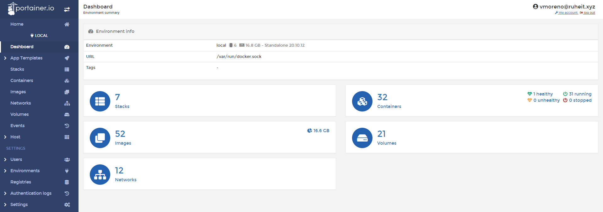
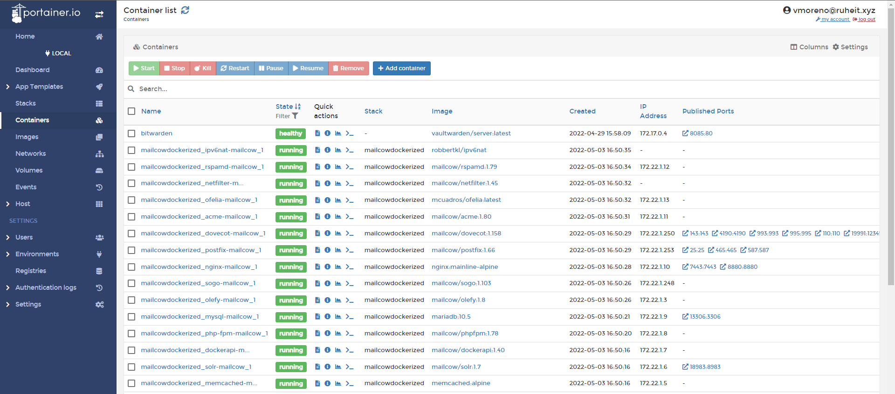
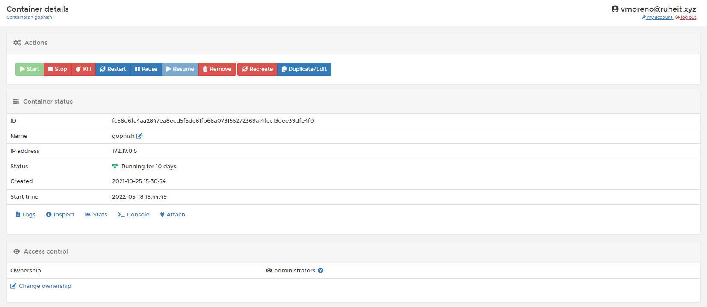
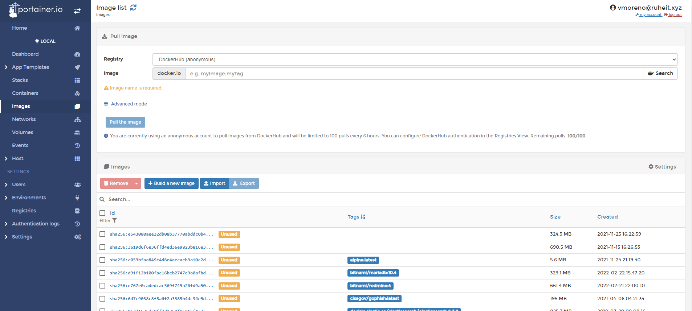
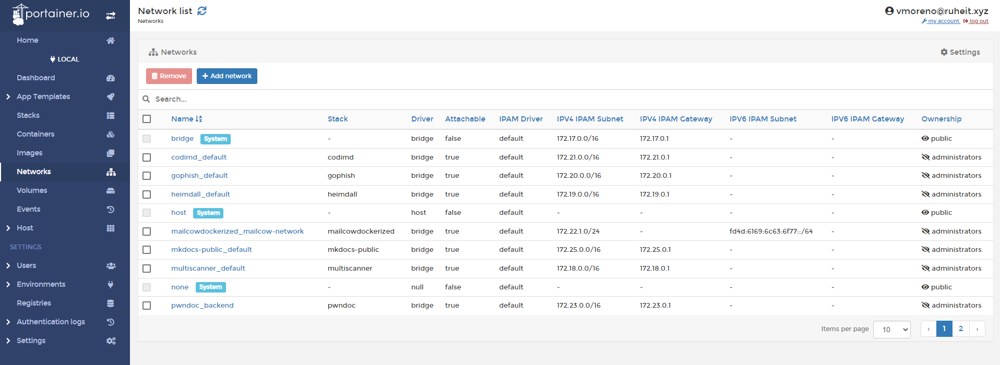
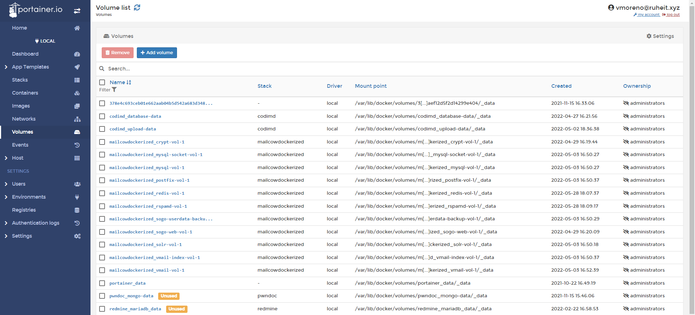

# Portainer

Portainer es un gestor universal de contenedores, puede gestionar Kubernetes, Docker y Nomad. 

Portainer se ejecuta como un contenedor de Docker, por lo que necesita que Docker esté instalado en la máquina donde vayamos a instalarlo.

Portainer puede conectarse a sus "nodos" de la siguiente manera:

* Local: a través del proceso sock de docker
* Edge Agent: se conecta al nodo a través de un agente de Portainer
* Azure: puede conectarse a clusters de Docker en Azure

Una de las grandes ventajas de Portainer es que a través del Portainer Edge Agent podemos centralizar la gestión de los nodos de docker de RuheIT desde un único lugar, lo que simplifica la gestión y la monitorización de estos.

Portainer permite el SSO con Azure AD, por lo que una vez más la autenticación es delegada a Azure AD, aumentando así la seguridad y unificación del login.

A través de Portainer, con grupos sincronizados de Azure AD, gestionamos el acceso (RBAC, role based access control) a los diferentes nodos y contenedores.

## Instalación de Portainer

```bash title="Comandos necesarios"
docker volume create portainer_data
docker run -d -p 9000:9000 -v /var/run/docker.sock:/var/run/docker.sock -v portainer_data:/data portainer/portainer
```

## Interfaz de Portainer



Al abrir Portainer y seleccionar el nodo nos aparecerá el Dasboard.

En ella se muestra un resumen de manera visual de nuestro sistema de Docker: 

* Número total de contenedores
* Número total de imágenes
* Número total de redes
* Número total de volúmenes

Esta sección es de gran utilidad para mostrarnos de manera global cual es el estado actual de Docker en nuestra máquina.

### Contenedores



El menú de Containers, nos mostrará la lista de todos nuestros contenedores, y podremos ejecutar a golpe de click varias de las típicas instrucciones que solemos ejecutar a través de la línea de comandos, como arrancarlos, pararlos o eliminarlos.  



También podemos ver detalles del propio contenedor. Si hacemos click en el nombre de un contenedor, entonces podemos conocer la información del mismo.

Aquí dentro podemos ver:

* Todas las operaciones mas habituales como parar, pausar, matar o borrar el contenedor
* Ver informaciones del contenedor (`docker inspect`)
* Crear una imagen nueva desde el mismo contenedor y añadirla a un registro (`docker commit`)
* Ver los logs del contenedor (`docker logs`)
* Ver las estadísticas del contenedor (`docker stats`)
* Entrar en el contenedor pudiendo elegir el shell o el usuario (`docker exec`)
* Conectar o desconectar el contenedor con una red (`docker network connect`)

### Imágenes



La sección de imágenes sería el equivalente a `docker images`, desde aquí podemos ver o eliminar las imágenes disponibles.

Una de las ventajas respecto a la línea de comandos es que:

* Podemos ordenar la lista por tags
* Podemos ordenar la lista por tamaño
* Nos muestra las imágenes que no usamos

### Networks



Desde la sección de Networks tenemos la posibilidad de ver las redes que ya tenemos creadas, podemos eliminarlas o añadir más desde el Wizard.

### Volúmenes



Desde Volumes, podemos ver:

* Volúmenes usados y no usados
* Ruta en el FS del host
* Stack (compose) al que pertenecen


