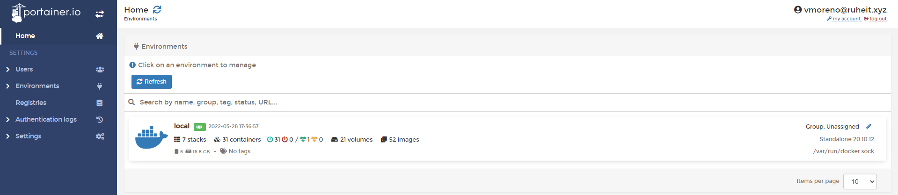

# Portainer

Portainer es un gestor universal de contenedores, puede gestionar Kubernetes, Docker y Nomad. 

Portainer se ejecuta como un contenedor de Docker, por lo que necesita que Docker esté instalado en la máquina donde vayamos a instalarlo.

Portainer puede conectarse a sus "nodos" de la siguiente manera:

* Local: a través del proceso sock de docker
* Edge Agent: se conecta al nodo a través de un agente de Portainer
* Azure: puede conectarse a clusters de Docker en Azure

Una de las grandes ventajas de Portainer es que a través del Portainer Edge Agent podemos centralizar la gestión de los nodos de docker de RuheIT desde un único lugar, lo que simplifica la gestión y la monitorización de estos.

Portainer permite el SSO con Azure AD, por lo que una vez más la autenticación es delegada a Azure AD, aumentando así la seguridad y unificación del login.

A través de Portainer, con grupos sincronizados de Azure AD, gestionamos el acceso (RBAC, role based access control) a los diferentes nodos y contenedores.

## Instalación de Portainer

```bash
docker volume create portainer_data
docker run -d -p 9000:9000 -v /var/run/docker.sock:/var/run/docker.sock -v portainer_data:/data portainer/portainer
```

## Interfaz de Portainer




