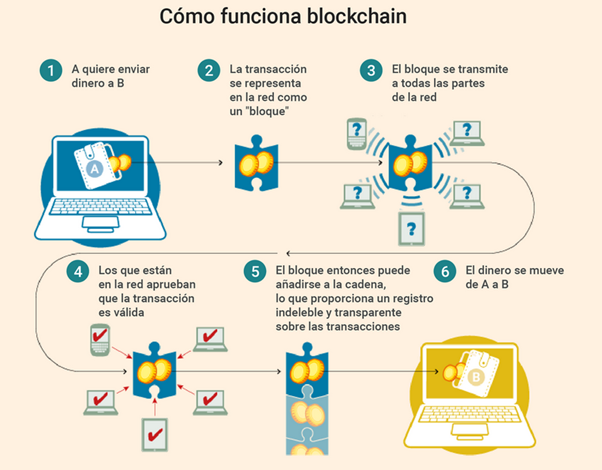

# Criptomonedas

## Información básica sobre Crypto

Para poder explicar cómo funciona de verdad nuestro token, es necesario saber cómo funciona la cadena de bloques que forman todos los token/criptomonedas. 

La cadena de bloques o blockchain elimina a los intermediarios (bancos), descentralizando toda la gestión de esta, es decir, que no es regulada por ningún organismo o empresa. El control de todo el proceso es de los usuarios. Se podría decir que es un libro gigantesco de cuentas en los que los registros (bloques) están enlazados y cifrados para proteger la seguridad y privacidad de las transacciones. Para que se cumpla la función de la blockhain, es necesario que estén varios usuarios (nodos) que se encarguen de verificar esas transacciones para validarlas y así el bloque correspondiente a esa transacción se registre en la blockchain.

Vamos a poner un ejemplo, si usuario “A” quiere retirar un Ethereum de su cuenta para enviárselo al usuario “B”, primero de todo, se avisa a todo el mundo con la peculiaridad de que nadie sabrá quién es el usuario A ni el usuario B, solo se sabe el numero de la cartera digital origen y la del destino cuando se realiza la transacción. Para que se confirme la transacción y se dé por válida, es necesario que todos los usuarios que se encuentran en la blockchain correspondiente comprueben que la cartera origen de la transacción tiene suficiente dinero para enviarlo, si se confirma esa parte, todos los usuarios anotaran la transacción que pasa a completarse y formar parte del bloque de transacciones, pero de momento no está registrado de forma definitiva en la base de datos. Cada bloque tiene una capacidad limitada ya que depende de la estructura de la cadena y el tamaño de cada transacción, entonces, cuando ese bloque es completado y no admite más transacciones, llega la hora de validarlo, que es a lo que se llama la “minería”.

Básicamente, la minería de bloques consiste en la realización de millones de operaciones matemáticas y/o cálculos que requieren tiempo y electricidad, durante el proceso de minado, los bloques quedan registrados de forma permanente en la blockchain, pero no pueden ser modificados ni alterados, a no ser que se alteren todos los bloques enlazados con el. Los mineros cuando reciben avisos de nuevas transacciones las reúnen en un nuevo bloque, pero entre todos los mineros se realiza como una especie de “competición” entre todos, ya que el que consigue crear el bloque validado entero, lo sella y recibe los bitcoins, o la criptomoneda la cual se está minando. También hay que decir que no se pueden revertir las transacciones, ya que así se asegura que el sistema no esté trucado o haya fraudes.

El hecho de añadir nuevos bloques és un proceso que cada vez les cuesta más a los mineros, ya que se ha creado un sistema llamado las “pools de farming” en lugar de trabajar cada uno de forma individual, ya que la probabilidad de éxisto es más baja que trabajando juntos. En este caso, cuando cualquier minero que compone la pool, consigue resolver ese cálculo, avisa a los demás mineros, para que todos lo verifiquen y añaden ese bloque a la cadena de bloques completa que tienen en sus ordenadores.
Cada bloque enlazado cuenta con un hash codificado el cual enlaza al bloque anterior, además de una marca de tiempo y los datos de la transacción són información púbica. Es decir que no podemos saber quien es cada usuario ya que se protege la privacidad de los usuarios, pero lo que significa que sea pública es, que permite controlar la trazabilidad de las transacciones realizadas.

Si queremos poder seguir el rastro de cada transacción, debemos ingresar en la página de cada blockchain en la que nos encontremos:

* [https://etherscan.io](https://etherscan.io): Blockchain de la criptomoneda “Ethereum”
* [https://bscscan.io](https://bscscan.io): Blockchain de la criptomoneda “Binance Coin” (RuheCoin)
* [https://solscan.io](https://solscan.io): Blockchain de la criptomoneda “Solana” (RuheCoin)
 
## NFTs

Vamos a pasar a hablar de un tema bastante actual, el cual són los NFT (Non fungible token), para ello debemos saber que en nuestro sistema jurídico, existen los bienes fungibles los cuales son los que pueden intercambiarse, teniendo un valor en función de  su número, medida o peso, en cambio, los bienes no fungibles son aquellos los cuales no los sustituibles. Para poner un ejemplo, un bien fungible podría ser el dinero, ya que lo puedes intercabiar sin problemas por cualquier billete o moneda y no pierde ningún valor y es exactamente igual. 

Por otra parte, un bien no fungible, en la realidad seria una obra de arte, ya que tiene un precio y és única en el mundo, en eso consisten los NFT, són activos únicos que no se pueden modificar ni intercambiar por otro que tenga el mismo valor, ya que no hay 2 NFT que sean equivalentes igual que no hay dos cuadros u obras de arte que lo sean.

### ¿Por qué se decidió crear el token de Ruhe?

Nuestro propósito como startup, és poder facilitar y ayudar a nuestros clientes. Entre otros decidimos crearlo, porque sabemos que será una opción muy buena para el futuro de la empresa y del mundo de la tecnología. Ya que Ruhe utiliza los famosos “Smart Contracts” o Contratos inteligentes 
Entre ellos RuheCoin, funciona sobre la red o blockchain “SOL” y “BSC”. 

Si queréis obtener más información de RuheCoin, os facilitamos los siguientes enlaces:

* Red BSC: [Accede aquí](https://bscscan.com/address/0x062bdc70536cf8fa1226c50e88a4524eddcb85d6)
* Red SOL: [Accede aquí](https://solscan.io/token/42pr4AkwMzHRspr8VXmP9mfaV8QP21WptmWA3SjNfAxS)

### ¿Cómo funcionan los NFTs?

Los NFT funcionan a través de la tecnología blockchain o cadena de bloques, la cual hemos comentado su función anteriormente. En este caso, a los NFT, se le asigna una especie de certificado digital de autenticidad, los cuales son unos metadatos que no se pueden modificar. En esos metadatos, se encuentran básicamente la autenticidad, se registra el valor de partida y todas las adquisiciones i/o transacciones que se hayan realizado. Es decir, que cuando tu compras un NFT, en cualquier momento siempre habrá constancia del primer valor que tenia. 

En este caso de los NFT, suelen ir basados en la red “Ethereum”, es sencillo operar con ellos para comprar/vender, pero una desventaja de la blockchain de Ethereum, és en sus comisiones, ya que són demasiada altas. 

