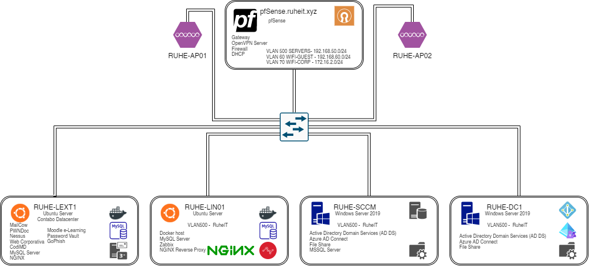

# Infraestructura

[TOC]
## Diagrama de infraestructura

## Proveedores de infraestructura

La infraestructura de RuheIT está distribuida en 2 "datacenters", uno interno localizado en la casa de uno de los integrantes del grupo y otro externo, usando de CSP (Cloud Service Provider) a Contabo.

!!! todo "Información"

    En el caso de que un datacenter fallase, sería posible migrar toda la infraestructura, ya que al estar virtualizada disponemos de backups de todo nuestro contenido.
    En un futuro se implementará un plan de DR (Disaster Recovery).

Cada "datacenter" tiene su propósito, hay aplicaciones que consideramos tenerlas internas ya que son de uso propio, sin embargo hay otras aplicaciones del negocio que han de estar expuestas a internet para que los clientes puedan acceder desde cualquier lugar. 

En todas las aplicaciones utilizamos Azure AD como SSO Provider, implementando así las medidas de seguridad que este servicio nos aporta (MFA, Acceso Condicional...)

### Datacenter Interno

En el datacenter interno tenemos mayormente aplicaciones locales, utilizadas para el desarrollo del negocio interno.

Algunas de las aplicaciones están expuestas a internet a través de un reverse proxy, otras sólo son accesibles internamente a través de la VPN Corporativa.

Disponemos de las siguientes aplicaciones

#### Zabbix

#### Grafana

#### Portainer

#### Pritunl

### Datacenter Externo

En el 

