# Intranet

## ¿Qué es una intranet?

## ¿Por qué necesitas una intranet en tu empresa?

## Introducción a nuestra intranet

La intranet de Ruhe IT es una aplicación interna destinada a ser usada por los empleados para solicitar vacaciones, solicitar días de baja y consultar sus correspondientes datos localizados en su perfil.

Está alojada en los servidores de la empresa, pero cualquiera puede acceder a ella mediante la URL [intranet.ruheit.xyz](https://intranet.ruheit.xyz).

<center>
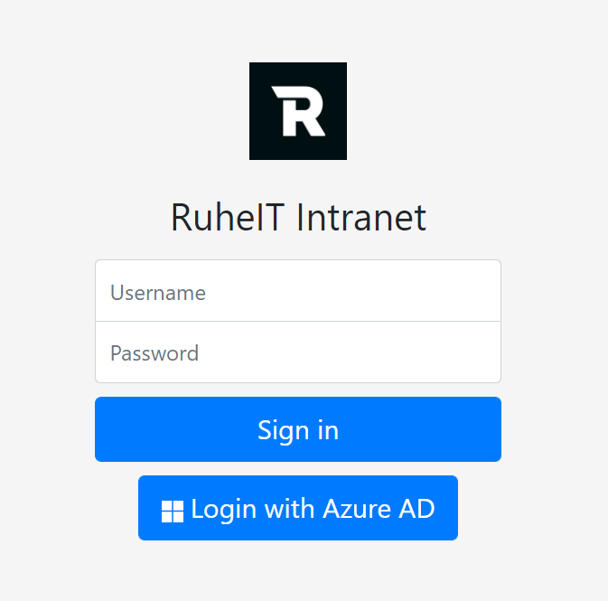
</center>

En esta URL lo primero que encontramos es el logo de Ruhe IT, seguido por el inicio de sesión a la Intranet donde se pueden ver 2 tipos de inicio de sesión, el primero, usando unas credenciales válidas (usuario y una contraseña) previamente proporcionadas por el equipo directivo, y el segundo, mediante OAuth2 usando una cuenta oficial de Microsoft con el dominio de Ruhe IT previamente proporcionada por el equipo directivo.

Una vez iniciada la sesión, lo primero que vemos es un menú, el cual el contenido del mismo dependerá de si el usuario que ha iniciado sesión tiene un rol administrativo o de trabajador común.

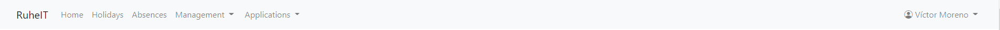

### Navbar de administrador

#### Management

Esta opción aparecerá únicamente para usuarios con rol administrativo, contiene las siguientes páginas:

- Requests
- User lists
- User creation

##### User List

Es un acceso a la lista de usuarios donde se podrán modificar los datos de los distintos usuarios.

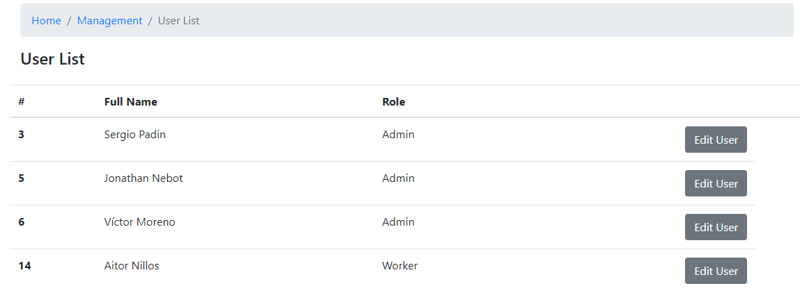

Dentro de cada usuario podemos editar sus propiedades

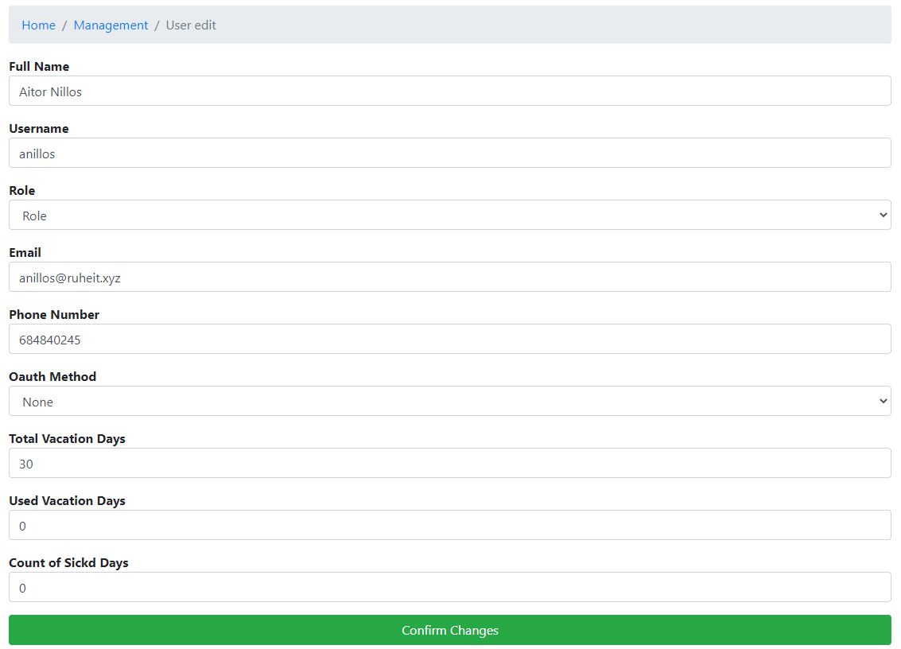

##### Requests

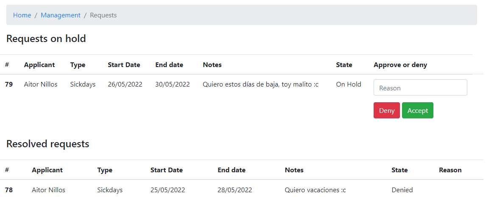

Es un acceso a las distintas peticiones tanto de vacaciones como de días de baja y podrán aceptar o declinar aquellas cuyo estado este "On Hold" (En espera) dando una razón en caso de ser necesario. También se podrán ver las peticiones ya cerradas.

##### User creation

Permite a un usuario administrador crear un usuario y añadirlo a la base de datos.

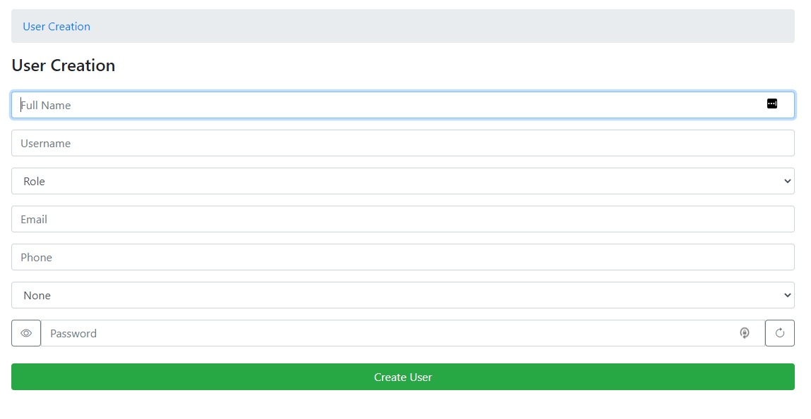

El formulario de "Sign Up" consta de la siguiente función que se encarga de crear una contraseña segura juntando mayúsculas, minúsculas, números y carácteres especiales.

```javascript title="Generador password segura, show/hide de password y alert para copiar password."
function generatePassword() {
  var length = 15,
    charset =
      "abcdefghijklmnopqrstuvwxyzABCDEFGHIJKLMNOPQRSTUVWXYZ0123456789!#$%&()*+,-./:;=?@^_`{|}~",
    retVal = "";
  for (var i = 0, n = charset.length; i < length; ++i) {
    retVal += charset.charAt(Math.floor(Math.random() * n));
  }
  document.getElementById("password").value = retVal;
}
function changeType() {
  var x = document.getElementById("password");
  if (x.type === "password") {
    x.type = "text";
  } else {
    x.type = "password";
  }
}
function passwordCopy() {
  var password = document.getElementById("password").value;
  alert("Be sure of copying the password: " + password);
}
```

En la opción de “Applications”, las opciones “Gophish”, “PwnDoc”, “CodiMD” y “Nessus” són exclusivas para aquellos con rol administrativo. Éstas opciones, contienen un acceso directo hacia la ubicación de dichas herramientas usadas para el correcto funcionamiento de la empresa.

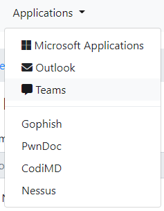

---

### Navbar para trabajadores

El trabajador común se encontrará con una barra de navegación más limitada en cuanto a opciones se refiere, las opciones de esta barra de navegación estarán en todos los usuarios.

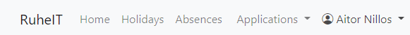

#### Home

Esta opción nos lleva a la página principal que aparecerá al iniciar sesión en cualquier usuario.
Lo primero que encontraremos en esta página, es un acceso directo a las funciones que el usuario podrá desempeñar en la intranet.
Estos accesos directos cambiarán en función del rol del usuario que inicie sesión.

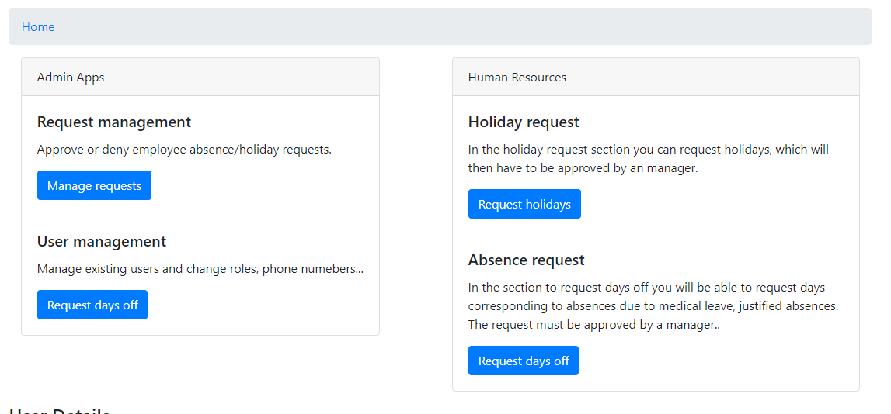

Si el usuario NO tiene un rol administrativo verá los siguientes accesos directos:

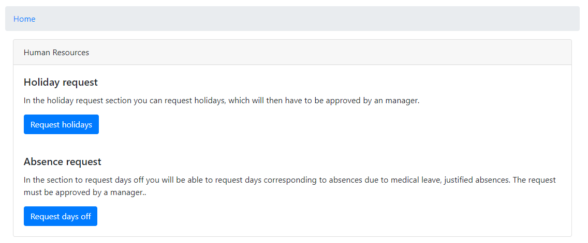

En Home, también se encuentran los datos del usuario que ha iniciado sesión:

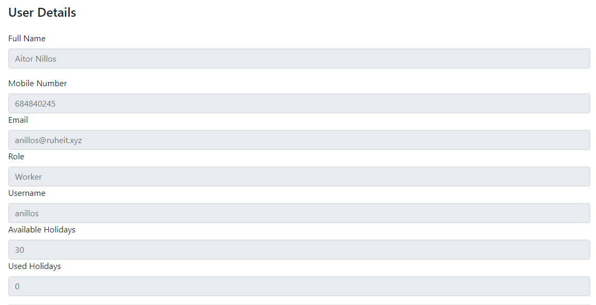

En la opción Holidays, se encuentra la página de solicitud de vacaciones, en el usuario deberá seleccionar una fecha de inicio y otra de fin (estas deberán ser correctas), y podrá añadir un mensaje en el apartado “Notes”.

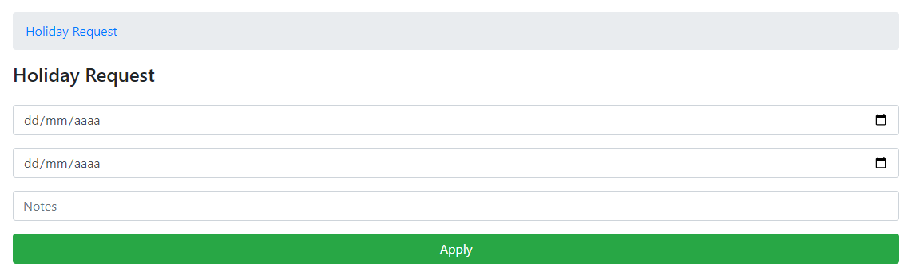

En la opción Absences, se encuentra la página de solicitud de días de baja, en el usuario deberá seleccionar una fecha de inicio y otra de fin (estas deberán ser correctas), y podrá añadir un mensaje en el apartado “Notes”.

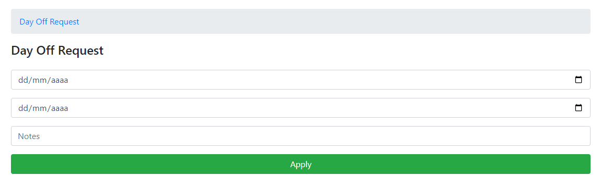

En la opción Applications, se despliega un menú con distintas opciones a elegir, en estas, se encuentran accesos directos hacia las distintas aplicaciones que los usuarios estándar de Ruhe IT usan. Cabe destacar que si el usuario no se ha iniciado sesión con Microsoft Azure, deberá hacerlo en el momento que quiera acceder a cualquiera de estas 3 opciones.

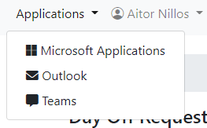

En la última opción, llamada como el nombre del usuario que ha iniciado sesión, se encuentra un desplegable con la opción Profile y la opción para cerrar sesión.

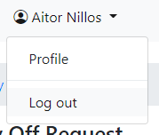

En Profile, se encuentra toda la información del usuario, junto con las peticiones que haya realizado, tanto las que estén en espera como las que ya han sido resueltas.

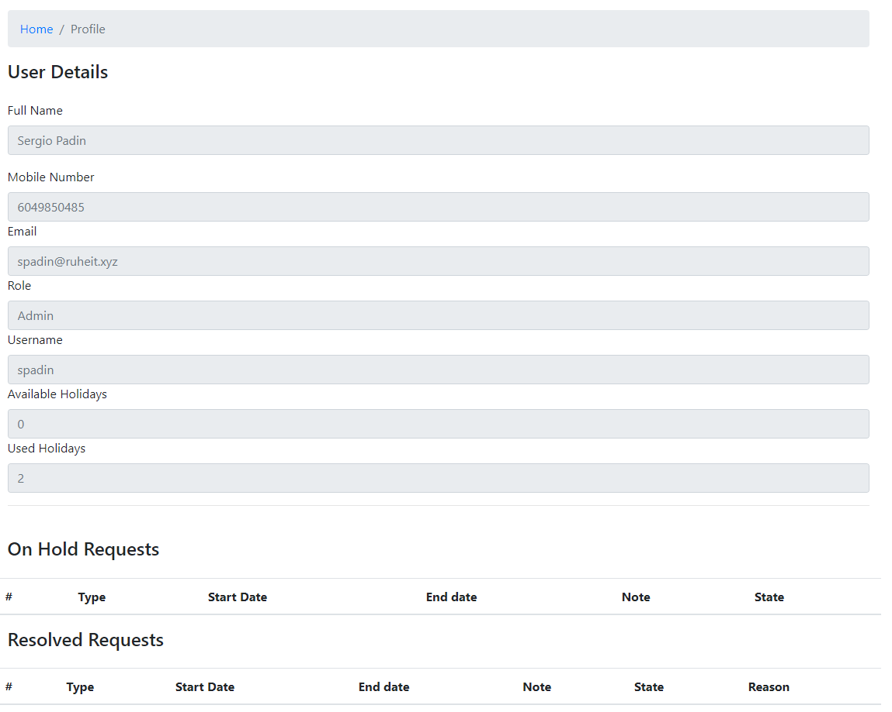

## Tecnologías usadas

Node JS: es un entorno de ejecución para JavaScript.

Para instalar Node.js, debemos entrar a la siguiente URL y descargarlo e instalarlo.

[Descargar NodeJS](https://nodejs.org/es/download/)

Una vez instalado, usamos el siguiente comando para iniciar un proyecto de Node.js.

```bash
npm install *paquete*
```

## Paquetes de Node instalados y usados

- Express: Es un framework de JavaScript dedicado a Back-End, este paquete permite instalar las librerías de funciones.
- Express-Handlebars: Este paquete permite integrar el motor de plantillas handlebars en express.
- Express-session: Administra las sesiones de la aplicación.
- MySQL: Este módulo permite conectarse y hacer consultas a una base de datos MySQL.
- Express-MySQL-session: Este módulo permite almacenar las sesiones en una base de datos MySQL.
- Morgan: Para crear logs o mensajes de las peticiones al servidor realizadas por los clientes.
- BcryptJS: Permite cifrar/descifrar texto y hacer comprobaciones sobre texto ya cifrado.
- Passport: Este módulo permite autenticar y gestionar el proceso de login de un usuario.
- Passport-Local: Es un complemento de passport para autenticar a los usuarios con una base de datos propia.
- Connect-Flash: Es un módulo que nos permite mostrar mensajes de error y éxito.
- Express-Validator: Es un módulo que nos permite validar los datos que el cliente nos envía.
- @azure/msal-node: Permite a la aplicación autenticar a los usuarios usando cuentas de Azure AD, Facebook, Google, etc. (en nuestro caso usaremos Azure AD).
- Handlebars-Helpers: Añade más funciones para usar con handlebars, factor que nos permite hacer sentencias if más complejas.

## ¿Qué es Oauth2?

OAuth2.0, es un estándar abierto que permite compartir datos entre distintas entidades sin necesidad de compartir la identidad.

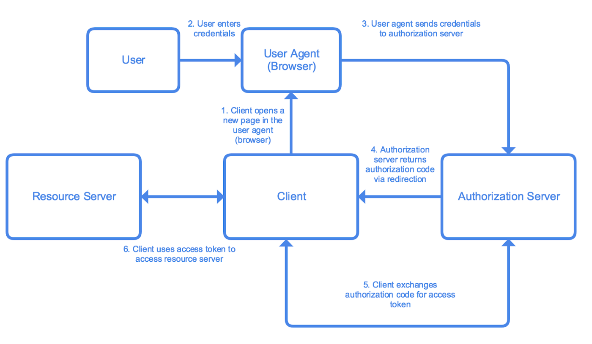

## ¿Por qué usamos Oauth2?

### ¿Cómo integramos Oauth2?

Primero creamos una aplicación en el Azure Active Directory para la Intranet. Una vez creada la aplicación, obtenemos los datos que posteriormente el código proporcionado por la documentación oficial de Microsoft nos pedirá para establecer una conexión con nuestra aplicación de Azure Active Directory. Estos datos son, el Id de la Aplicación, el Id de la Instancia de Cloud, y el `Tenant Id`. También será necesario un código secreto de cliente, éste se crea accediendo al panel de administración de la aplicación previamente creada en el Azure Active Directory, en la opción Certificados y Secretos.
Una vez obtenidos todos los datos necesarios para la configuración de la conexión de la intranet con la aplicación creada en Azure Active Directory, accedemos a la documentación oficial de Microsoft, puesto que nos proporciona el código necesario para poder establecer dicha conexión.

Código para instalar los paquetes necesarios para integrar la OAuth2.0:

```nodejsrepl
npm install --save @azure/msal-node
```

Código que importa las funciones necesarias para el proceso y las almacena en la constante msal:

```nodejsrepl
const msal = require('@azure/msal-node');
```

Código que almacena la configuración de la conexión a la aplicación ubicada en el Azure Active Directory y la almacena en la constante config:

```nodejsrepl
const config = {
        auth: {
            clientId: "Id de la Aplicación",
            authority: "Id de la Instancia de Cloud/Tenant Id",
            clientSecret: "Código Secreto de Cliente"
        },
        system: {
            loggerOptions: {
                loggerCallback(loglevel, message, containsPii) {
                    console.log(message);
                },
         	   piiLoggingEnabled: false,
         	   logLevel: msal.LogLevel.Verbose,
            }
        }
    };
```

Código que establece la conexión entre la Intranet y la aplicación de Azure Active Directory:

```nodejsrepl
// Create msal application object
    const cca = new msal.ConfidentialClientApplication(config);
    app.get('/', (req, res) => {
        const authCodeUrlParameters = {
            scopes: ["user.read"],
            redirectUri: "URL de redirección",
        };

        // get url to sign user in and consent to scopes needed for application
        cca.getAuthCodeUrl(authCodeUrlParameters).then((response) => {
            res.redirect(response);
        }).catch((error) => console.log(JSON.stringify(error)));
    });

    app.get('/redirect', (req, res) => {
        const tokenRequest = {
            code: req.query.code,
            scopes: ["user.read"],
            redirectUri: "URL de redirección",
        };

        cca.acquireTokenByCode(tokenRequest).then((response) => {
            console.log("\nResponse: \n:", response);
            const email = response.account.username;
        	const accessToken = response.accessToken;
        	res.render('email', {email});

        }).catch((error) => {
            console.log(error);
            res.status(500).send(error);
        });
    });

```

Una vez conseguimos establecer la conexión entre la Intranet y la aplicación de Azure Active Directory, y un usuario inicia sesión con Azure, el servidor de la Intranet recibe los datos del usuario almacenados en el Azure Active Directory, y con estos datos hacemos una comprobación con la base de datos alojada en MySQL, una vez realizada la comprobación, creamos una nueva sesión y almacenamos los datos del usuario en ella.

```nodejsrepl

router.post('/signin/azure/email', isNotLoggedIn, (req, res, next) => {

    passport.authenticate('azure.signin', {

        successRedirect: '/profile',

        failureRedirect: '/signin',

        failureFlash: true

    })(req, res, next);

});


passport.use('azure.signin', new LocalStrategy({

    usernameField: 'username',

    passwordField: 'password',

    passReqToCallback: true // por si necesitamos un dato extra

}, async (req, username, password, done) => {

    console.log(password);

    const rows = await pool.query('SELECT * FROM users WHERE email = ?', [username]);

    if (rows.length > 0) {

        const user = rows[0];

        if (user) {

            done(null, user, req.flash('success', 'Welcome ' + user.fullname));

        } else {

            done(null, false, req.flash('message', 'Invalid Credentials!'));

        }

    } else {

        return done (null, false, req.flash('message', 'Invalid Credentials!')); // con esto le decimos que no es un error, solo que como no ha encontrado nada no le devolvemos nada.

    }

}));
```

## MySQL

Es un sistema de creación y gestión de bases de datos relacional.

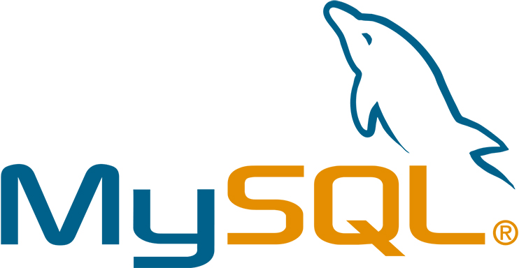

Con MySQL hemos creado la base de datos "intranet" con las siguientes tables:


## Handlebars

Handlebars es un popular sistema de plantillas en Javascript que te permite crear y formatear código HTML de una manera muy sencilla


Código para instalar los paquetes necesarios para integrar Handlebars:

```nodejsrepl title="Código para instalar los paquetes necesarios para integrar Handlebars"
npm install express-handlebars
```

La intranet consta de un archivo main que es usado como plantilla para todos los archivos de handlebars que contienen el front-end. Este archivo main contiene los estilos usados en todas las páginas, y el siguiente código contiene el contenido de las páginas.

```handlebars title="Navigation include"
{{> navigation }}
```

Contiene la barra de navegación, como contiene el >, el contenido no variará.

Con la siguiente sentencia if, hemos podido hacer que la barra de navegación sólo se muestre en el caso de que un usuario haya iniciado sesión.

```nodejsrepl title="Código para mostrar nav"
{{#if user}}
```

Con la siguiente sentencia if, hemos podido ocultar/mostrar contenido de la barra de navegación en función del rol del usuario que ha iniciado sesión.

```nodejsrepl title="Comparador de roles"
{{#if (compare user.role '===' 'Admin')}}
```

Ésta última sentencia ha sido posible gracias al uso del paquete handlebars-helpers, que se instala con el siguiente comando:

```nodejsrepl title="Instalación de helpers HBS"
npm install --save handlebars-helpers
```