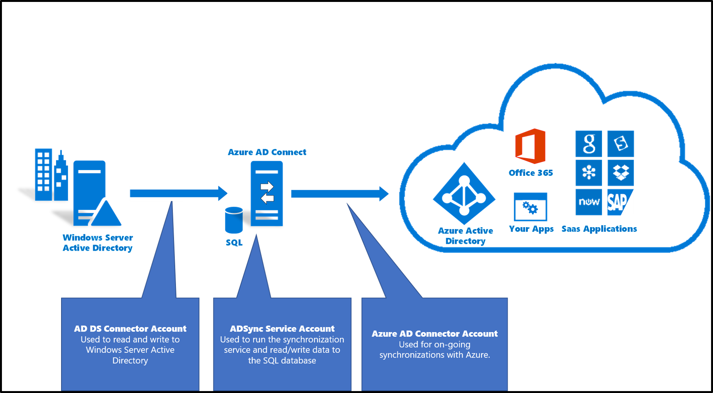
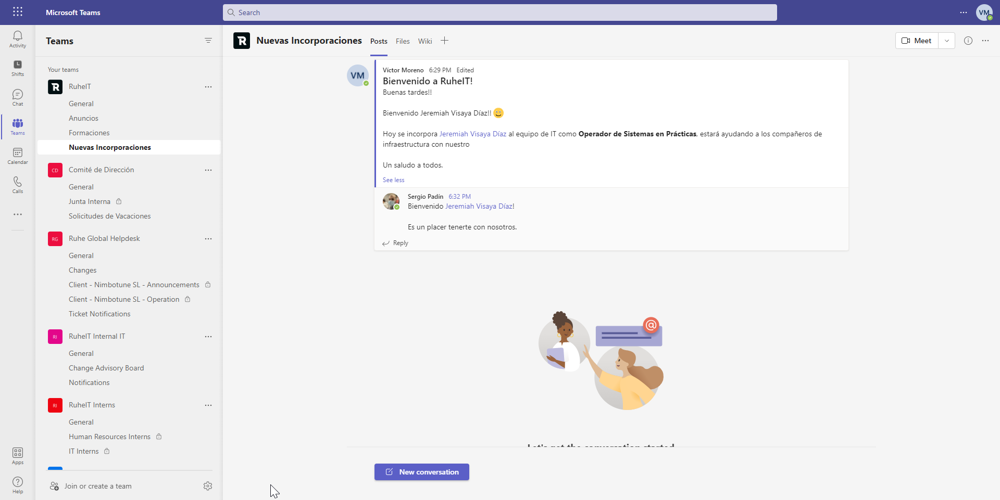

# Microsoft 365 y Azure

En RuheIT utilizamos la suite de Microsoft 365 para desarollar nuestro negocio, utilizamos las diferentes herramientas proporcionadas por Microsoft para colaborar.

## ¿Qué es un tenant?

## Federación y sincronización de usuarios

Como podemos ver en el esquema de infraestructura, en RuheIT disponemos de un servidor Windows con los servicios de dominio de Windows (AD DS) instalados, en conjunto, tenemos instalado el conector de Microsoft AD Connect, que permite sincronizar usuarios con Azure AD.

Una vez sincronizados los usuarios con Azure AD, estos usuarios se crean en Microsoft 365. En la siguiente imagen, podemos ver como funciona la sincronización de usuarios.

### Grupos creados

En RuheIT gestionamos el control de accesos con grupos, los grupos pueden estar de dos maneras:

* Sincronizados de Active Directory (vía AD Connect)
* Grupos de Azure AD

Hay varios tipos de grupos:

* Grupos de Seguridad
* Grupos de Microsoft 365

## Grupos de Seguridad

Los grupos de seguridad suelen ser utilizados para restringir/conceder acceso a usuarios, dispositivos, grupos o service principals (aplicaciones registradas). 

Este tipo de grupos son los únicos grupos que pueden ser sincronizados desde un entorno On-Premise, por lo que no pueden ser gestionados desde Azure AD si son sincronizados. 

Los grupos cloud, sí es posible gestionarlos desde Azure AD, este tipo de grupos puede ser gestionado por:

* Global Administrator
* Directory Writers
* Group Administrator
* Privileged Role Administrator
* SharePoint Administrator
* User Administrator

***

| DisplayName                     | Description                                                                                                      |
|---------------------------------|------------------------------------------------------------------------------------------------------------------|
| DnsUpdateProxy                  | DNS clients who are permitted to perform dynamic updates on behalf of some other clients (such as DHCP servers). |
| RGS_TicketingAdmin              | Grants access to ticketing system as admin                                                                       |
| WP_Comunicacion                 | Grants access to ruheit.xyz Wordpress as Writer via Azure AD App                                                 |
| Comit&#233; de Direcci&#243;n   | Comit&#233; de Direcci&#243;n de RuheIT                                                                          |
| M365BackupUsers                 | Users that get backed up with Veeam                                                                              |
| VPN_Users                       | Users that can use VPN                                                                                           |
| CTF_USERS                       |
| Monitoring_Admin                | Grant acces to monitoring system as admin                                                                        |
| RuheIT Security Team            | RuheIT Security Team                                                                                             |
| CTF_VPN                         |
| RuheIT Internal IT              | RuheIT Internal IT                                                                                               |
| ADSyncOperators                 | ADSyncOperators                                                                                                  |
| RuheIT                          | All RuheIT Internal Users                                                                                        |
| All Company                     | This is the default group for everyone in the network                                                            |
| ADSyncBrowse                    | ADSyncBrowse                                                                                                     |
| AAD_CodiMD                      | Enables access to CodiMD via AAD SSO                                                                             |
| IT_FULLADMIN                    | Enterprise Admins                                                                                                |
| O365_E5_Users                   | Office 365 E5 License                                                                                            |
| ADSyncAdmins                    | ADSyncAdmins                                                                                                     |
| RuheIT Interns                  | Usuarios en pr&#225;cticas                                                                                       |
| WP_Admin                        | Grants access to ruheit.xyz Wordpress as Administrator via Azure AD App                                          |
| RUHE_EXTERNAL_USERS             | External Company Users                                                                                           |
| Azure ATP ruheit Viewers        |
| RGS_Ticketing                   | Grants access to ticketing system                                                                                |
| VDI_Users                       | Grants access to VDI Infrastructure                                                                              |
| WIKI_Users                      | Grants access to the Wiki                                                                                        |
| RuheIT Development Team         | RuheIT Development Team                                                                                          |
| RuheIT Infra Team               | RuheIT Infra Team                                                                                                |
| ADSyncPasswordSet               | ADSyncPasswordSet                                                                                                |
| WPAlerts                        |
| Marketing                       | Marketing Distribution List                                                                                      |
| INT_Intranet_Users              | Grants access to intranet                                                                                        |
| AAD_GlobalAdmin                 |
| IT                              | IT Distribution List                                                                                             |
| O365_GlobalAdmin                | Global Admin Role on Office 365                                                                                  |
| Azure ATP ruheit Users          |
| Ruhe Global Helpdesk            | Global Helpdesk Team (Unified Delivery)                                                                          |
| Monitoring_Users                | Grants access to monitoring system                                                                               |
| DnsAdmins                       | DNS Administrators Group                                                                                         |
| AAD_Passwordless                | Users that can use passwordless authentication in AAD                                                            |
| SCCM_APPS                       | Access to all SCCM APPS                                                                                          |
| Azure ATP ruheit Administrators |

## Microsoft Teams

En RuheIT utilizamos Microsoft Teams para la comunicación interna, creando así varios equipos para fomentar la colaboración de los empleados en la empresa.

Los equipos de Teams también son utilizados para guardar información. Cada equipo tiene Canales, que permiten informar y guardar archivos de manera ordenada.

Cada canal está linkeado a un sitio de Sharepoint.

Los canales de Microsoft Teams también son usados para notificar eventos, cambios... cada departamento dispone de su canal de Teams.

En RuheIT, disponemos de los siguientes grupos de Microsoft 365 con equipos de Teams habilitados para organizar la operación y gestión de la compañía:

| Nombre                        | Dirección de correo electrónico        |
|:-------------------------------:|:----------------------------------------:|
| All Company                   | allcompany@ruheit.onmicrosoft.com      |
| RuheIT                        | teams@ruheit.xyz                       |
| Ruhe Global Helpdesk          | ruhe-global-helpdesk@ruheit.xyz        |
| Comit&#233; de Direcci&#243;n | comitedireccion@ruheit.onmicrosoft.com |
| RuheIT Internal IT            | RuheInternalIT@ruheit.xyz              |
| RuheIT Interns                | interns@ruheit.onmicrosoft.com         |
| RuheIT Development Team       | ruhe-dev-team@ruheit.onmicrosoft.com   |
| RuheIT Security Team          | ruhe-sec-team@ruheit.onmicrosoft.com   |
| RuheIT Infra Team             | ruhe-infra-team@ruheit.onmicrosoft.com |

Cada departamento tiene su grupo propio, y es posible gestionarlos
## Aplicaciones de Azure

Las aplicaciones de Azure AD son utilizadas con varios fines, por ejemplo:

* SSO de aplicaciones
* Reporte de tareas programadas obteniendo datos de Azure.

| Nombre de la aplicación| Tenant        |
|:----------------------:|:----------------------:|
| Grafana RuheIT         | ruheit.onmicrosoft.com |
| CodiMD RuheIT          | ruheit.onmicrosoft.com |
| RuheIT Scheduled Tasks | ruheit.onmicrosoft.com |
| Moodle RuheIT          | ruheit.onmicrosoft.com |
| RuheIT Intranet        | ruheit.onmicrosoft.com |
| Guacamole RuheIT       | ruheit.onmicrosoft.com |
| WordPress RuheIT       | ruheit.onmicrosoft.com |
| Veeam RuheIT           | ruheit.onmicrosoft.com |
| RuheIT 3CX             | ruheit.onmicrosoft.com |
| PRE_RuheIT Intranet    | ruheit.onmicrosoft.com |
| RuheIT Portainer       | ruheit.xyz             |

