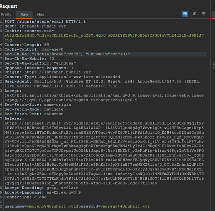

# Authentication Bypass (intranet.ruheit.xyz)

Si realizamos una petición "Login with Azure" en la ruta `/signin/azure/email` y la interceptamos con el intermediario "Burpsuite" vemos como se está enviando la petición, utilizando el método POST, vemos que se está enviando los campos username & password".

