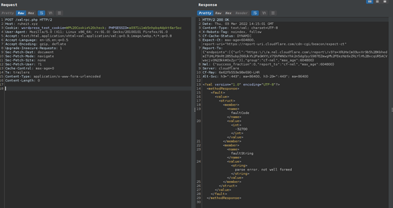

## Vulnerabilidad XMLRPC (WordPress)

Esta vulnerabilidad consistía en que si un atacante conseguía realizar una petición web por el método POST al fichero xmlrpc.php y veía que existía, teniendo credenciales validas, le permitiría crear artículos, subir ficheros maliciosos…

Esta seria la petición del atacante por el método POST hacia el archivo xmlrpc.php

``` title="Request al archivo xmlrpc.php"
POST /xmlrpc.php HTTP/1.1
Host: example.com
Content-Length: 135

<?xml version="1.0" encoding="utf-8" ?>
<methodCall>
<methodName>system.listMethods</methodName>
<params></params>
</methodCall>
```

Y esta seria la respuesta del lado del servidor, y vemos que nos contesta con un código de estado “200 OK”, esta es una lista de los métodos que podemos realizar sobre el WordPress.

``` title="Respuesta del servidor"
HTTP/1.1 200 OK
Date: Sat, 06 Oct 2001 23:20:04 GMT
Server: Apache.1.3.12 (Unix)
Connection: close
Content-Type: text/xml
Content-Length: 124

<?xml version="1.0"?>
<methodResponse>
   <params>
      <param>
         <value><double>18.24668429131</double></value>
      </param>
   </params>
</methodResponse>
```
La prevención de este ataque seria deshabilitar el fichero mediante un plugin “Disable XML-RPC”, entonces el atacante no tendría probabilidad de poder leer este archivo, y poder realizar peticiones de crear artículos, subir ficheros… ya que este archivo permite comunicarse con la API.

<center>

</center>

Podemos ver que una vez deshabilitado el xmlrpc, si volvemos a realizar la petición al archivo, ya no recibimos la respuesta de todos los métodos que podemos utilizar.

<center>

</center>