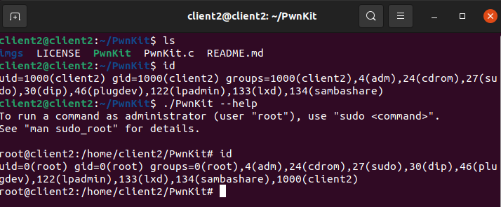

# Vulnerabilidad PKEXEC (PwnKit)

Esta vulnerabilidad permite explotar un sistema Linux (Ubuntu, Debian, Kali, Parrot…) el cual permite aprovecharse mediante un binario SUID preinstalado en el sistema llamado “PKEXEC”

Vemos que tiene el privilegio SUID, que quiere decir que podemos ejecutar ese binario como el propietario, entonces nos podemos aprovechar utilizando el nuevo exploit que ha aparecido para convertirnos en root, solo con haber ganado acceso al sistema.

```bash title="Detalle del binario"
root@srv1:~# which pkexec
/usr/bin/pkexec
root@srv1:~# which pkexec | xargs ls -l
-rwxr-xr-x 1 root root 31032 Jan 12 13:33 /usr/bin/pkexec
root@srv1:~#
```
Realizando los siguientes comandos, como un usuario normal, podemos escalar privilegios y convertirnos en root.

<center>

</center>

Para prevenir esta vulnerabilidad, seria eliminarle el permiso SUID al binario “/usr/bin/pkexec”, de la siguiente forma.

```bash title="Mitigación PwnKit"
root@srv1:~# chmod 0755 /usr/bin/pkexec
root@srv1:~# which pkexec | xargs ls -l
-rwxr-xr-x 1 root root 31032 Jan 12 13:33 /usr/bin/pkexec
root@srv1:~#
```
También una forma de prevención, seria realizar el siguiente comando, que seria la forma más fácil.

* Actualización del sistema (depende el OS)
