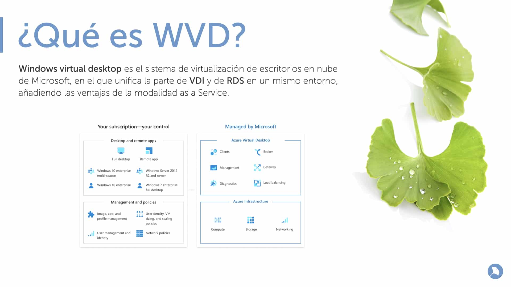

# VDI

Azure Virtual Desktop es un servicio de virtualización de escritorios y aplicaciones que se ejecuta dentro de Microsoft Azure, permite desplegar programas

## ¿Qué se puede hacer con AVD?

* Configurar una implementación de Windows 11 o Windows 10 de sesión múltiple que ofrezca toda la funcionalidad de Windows con escalabilidad
* Desplegar las aplicaciones de Microsoft 365 para la empresa y optimizarlo para ejecutarse en escenarios virtuales multiusuario
* Proporcionar escritorios virtuales de Windows 7 con actualizaciones gratuitas de seguridad ampliada (no LTSC)
* Llevar sus aplicaciones y escritorios existentes de Servicios de Escritorio remoto (RDS) y Windows Server a cualquier equipo
* Virtualizar escritorios y aplicaciones

Microsoft Recomienda el despliegue de la siguiente manera

## ¿AVD vs RDS?

### El sistema operativo

La principal diferencia entre RDS y AVD es que RDS está basado en un sistema operativo de servidor, mientras que AVD utiliza Windows 10 (próximamente W11).

AVD es el IaaS y el PaaS, mientras que RDS es un DaaS (Desktop as a Service).

### La gestión de infraestructura

En AVD la infraestructura es mantenida por Microsoft, mientras que en RDS el cliente se encarga de mantenerla en su datacenter o en un CSP. AVD tiene todas las ventajas de tener máquinas virtuales en Azure.

### Licenciamiento

En AVD no es necesario disponer de CAL (Client Access Licenses), ya está incluido con la licencia del usuario (esta licencia que ya incluye Office, Sharepoint, OneDrive...).

En RDS es obligatorio pagar cada CAL.

***
## ¿Qué escoger?

WVD proporciona:

* Ser la última tecnología, soportada por Microsoft.
* Permite la gestión de perfiles (roaming profiles) via FSLogix
* Gestión PaaS
* Integración con OneDrive
## Alternativas a AVD

* Citrix Desktop

